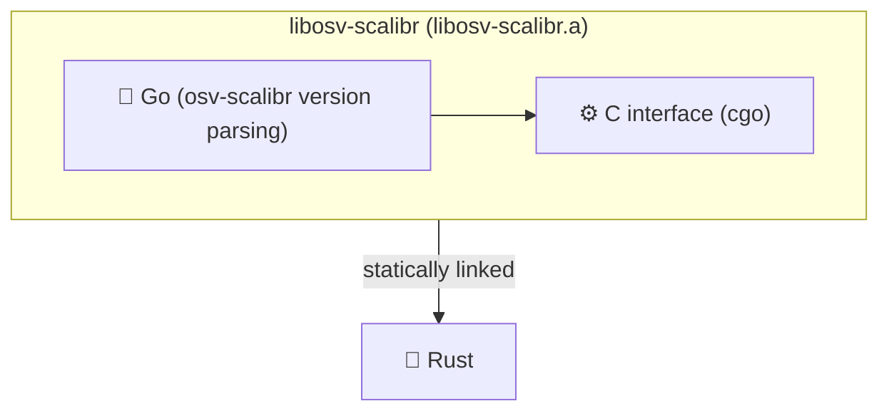

# osv-analyzer

Rust bindings for [osv-scalibr](https://github.com/google/osv-scalibr) — Google's ecosystem-aware version parsing library used by the [Open Source Vulnerability](https://osv.dev) (OSV) project.

> [!WARNING]
> The API is unstable and could change in the future.

[osv-scalibr](https://github.com/google/osv-scalibr) implements semantic version parsing for a wide range of package ecosystems (written in Go). The build script compiles it into a static archive (`libosv-scalibr.a`) via cgo, which is then statically linked into the Rust crate, exposing a safe Rust API on top.

## Requirements

- **Go 1.24+** — the Go toolchain is required to compile the embedded library.

## Examples

More examples can be found in the [`examples/`](examples/) directory.
